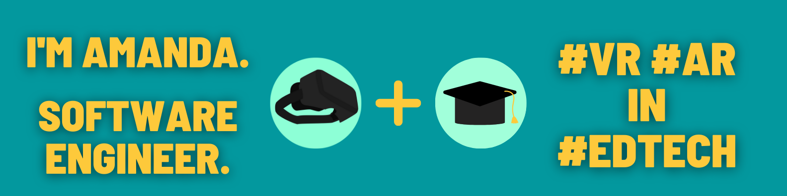

<h1 align="center">Intro</h1>
I'm a Teacher turned Techie. After 8 years in the classroom teaching English and computer science among other subjects, I realized how much room there is for improvements and advancements in technology and programs that are available for teachers and students. Through the frustrations of dealing with technical issues with trying to teach, I developed a passion for fixing those problems and helping teachers. After getting involved in VR at the last school I worked at, I realized what I could do with VR in my classroom with programs that do not yet exist. That was when I realized I wanted to push towards learning software engineering with the ultimate goal for working at an EdTech Company making VR programs for teachers, students, and schools.

Check out [my website](https://amanda-faulkenberry.netlify.app/) to get in touch!
<h1 align="center">Technologies</h1>

    
    
    
    
    
    
    
    
    

<h1 align="center">Connect</h1>

  
  
  
  

<h1 align="center">Non-Technical Fun Facts</h1>
<ol>
    <li>I've published 3 books under the name A.L.Faulkenberry (Immortality: The beginning of the end, For the love of sisters, Lessons from within)</li>
    <li>I've studied Eskrima Pangolisi for about 5 years and I studied TaeKwonDo and TaiChi for about 2 years</li>
</ol>

<h1 align="center">GitHub Stats</h1>

 
